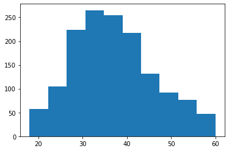
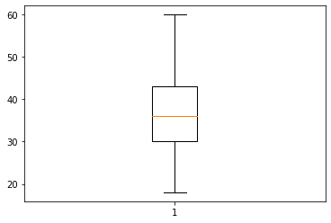
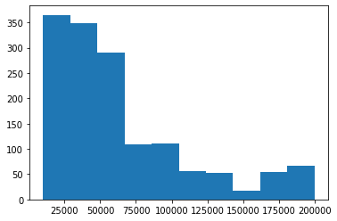
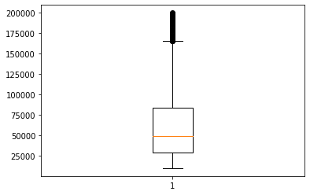

Attrition analysis


```python
import pandas as pd
```


```python
dataset=pd.read_csv("Attrition Rate Analysis.csv")
```


```python
dataset.columns
```


    Index(['Age', 'Attrition', 'BusinessTravel', 'Department', 'DistanceFromHome',
           'Education', 'EducationField', 'EmployeeCount', 'EmployeeID', 'Gender',
           'JobLevel', 'JobRole', 'MaritalStatus', 'MonthlyIncome',
           'NumCompaniesWorked', 'Over18', 'PercentSalaryHike', 'StandardHours',
           'StockOptionLevel', 'TotalWorkingYears', 'TrainingTimesLastYear',
           'YearsAtCompany', 'YearsSinceLastPromotion', 'YearsWithCurrManager'],
          dtype='object')


```python
dataset.shape
```


    (4410, 24)


```python
dataset.head()
```


<div>
<style scoped>
    .dataframe tbody tr th:only-of-type {
        vertical-align: middle;
    }

    .dataframe tbody tr th {
        vertical-align: top;
    }

    .dataframe thead th {
        text-align: right;
    }
</style>
<table border="1" class="dataframe">
  <thead>
    <tr style="text-align: right;">
      <th></th>
      <th>Age</th>
      <th>Attrition</th>
      <th>BusinessTravel</th>
      <th>Department</th>
      <th>DistanceFromHome</th>
      <th>Education</th>
      <th>EducationField</th>
      <th>EmployeeCount</th>
      <th>EmployeeID</th>
      <th>Gender</th>
      <th>...</th>
      <th>NumCompaniesWorked</th>
      <th>Over18</th>
      <th>PercentSalaryHike</th>
      <th>StandardHours</th>
      <th>StockOptionLevel</th>
      <th>TotalWorkingYears</th>
      <th>TrainingTimesLastYear</th>
      <th>YearsAtCompany</th>
      <th>YearsSinceLastPromotion</th>
      <th>YearsWithCurrManager</th>
    </tr>
  </thead>
  <tbody>
    <tr>
      <th>0</th>
      <td>51</td>
      <td>No</td>
      <td>Travel_Rarely</td>
      <td>Sales</td>
      <td>6</td>
      <td>2</td>
      <td>Life Sciences</td>
      <td>1</td>
      <td>1</td>
      <td>Female</td>
      <td>...</td>
      <td>1.0</td>
      <td>Y</td>
      <td>11</td>
      <td>8</td>
      <td>0</td>
      <td>1.0</td>
      <td>6</td>
      <td>1</td>
      <td>0</td>
      <td>0</td>
    </tr>
    <tr>
      <th>1</th>
      <td>31</td>
      <td>Yes</td>
      <td>Travel_Frequently</td>
      <td>Research &amp; Development</td>
      <td>10</td>
      <td>1</td>
      <td>Life Sciences</td>
      <td>1</td>
      <td>2</td>
      <td>Female</td>
      <td>...</td>
      <td>0.0</td>
      <td>Y</td>
      <td>23</td>
      <td>8</td>
      <td>1</td>
      <td>6.0</td>
      <td>3</td>
      <td>5</td>
      <td>1</td>
      <td>4</td>
    </tr>
    <tr>
      <th>2</th>
      <td>32</td>
      <td>No</td>
      <td>Travel_Frequently</td>
      <td>Research &amp; Development</td>
      <td>17</td>
      <td>4</td>
      <td>Other</td>
      <td>1</td>
      <td>3</td>
      <td>Male</td>
      <td>...</td>
      <td>1.0</td>
      <td>Y</td>
      <td>15</td>
      <td>8</td>
      <td>3</td>
      <td>5.0</td>
      <td>2</td>
      <td>5</td>
      <td>0</td>
      <td>3</td>
    </tr>
    <tr>
      <th>3</th>
      <td>38</td>
      <td>No</td>
      <td>Non-Travel</td>
      <td>Research &amp; Development</td>
      <td>2</td>
      <td>5</td>
      <td>Life Sciences</td>
      <td>1</td>
      <td>4</td>
      <td>Male</td>
      <td>...</td>
      <td>3.0</td>
      <td>Y</td>
      <td>11</td>
      <td>8</td>
      <td>3</td>
      <td>13.0</td>
      <td>5</td>
      <td>8</td>
      <td>7</td>
      <td>5</td>
    </tr>
    <tr>
      <th>4</th>
      <td>32</td>
      <td>No</td>
      <td>Travel_Rarely</td>
      <td>Research &amp; Development</td>
      <td>10</td>
      <td>1</td>
      <td>Medical</td>
      <td>1</td>
      <td>5</td>
      <td>Male</td>
      <td>...</td>
      <td>4.0</td>
      <td>Y</td>
      <td>12</td>
      <td>8</td>
      <td>2</td>
      <td>9.0</td>
      <td>2</td>
      <td>6</td>
      <td>0</td>
      <td>4</td>
    </tr>
  </tbody>
</table>
<p>5 rows × 24 columns</p>
</div>


```python
dataset1=dataset.drop(['EmployeeCount', 'EmployeeID','Over18'],axis=1)
```


```python
dataset2=dataset1.dropna()
```


```python
dataset3=dataset2.drop_duplicates()
```


```python
#converting text to int
from sklearn import preprocessing
le=preprocessing.LabelEncoder()
dataset3['Gender']=le.fit_transform(dataset3['Gender'])
```

    <ipython-input-13-6b1793adff6f>:4: SettingWithCopyWarning: 
    A value is trying to be set on a copy of a slice from a DataFrame.
    Try using .loc[row_indexer,col_indexer] = value instead
    
    See the caveats in the documentation: https://pandas.pydata.org/pandas-docs/stable/user_guide/indexing.html#returning-a-view-versus-a-copy
      dataset3['Gender']=le.fit_transform(dataset3['Gender'])
    


```python
dataset3['Attrition']=le.fit_transform(dataset3['Attrition'])
```

    <ipython-input-14-9ada37e342e8>:1: SettingWithCopyWarning: 
    A value is trying to be set on a copy of a slice from a DataFrame.
    Try using .loc[row_indexer,col_indexer] = value instead
    
    See the caveats in the documentation: https://pandas.pydata.org/pandas-docs/stable/user_guide/indexing.html#returning-a-view-versus-a-copy
      dataset3['Attrition']=le.fit_transform(dataset3['Attrition'])
    


```python
dataset3['Gender']
```


    0       0
    1       0
    2       1
    3       1
    4       1
           ..
    2117    0
    2269    0
    2402    1
    2573    1
    2782    1
    Name: Gender, Length: 1470, dtype: int32


```python
dataset['Attrition']
```


    0        No
    1       Yes
    2        No
    3        No
    4        No
           ... 
    4405     No
    4406     No
    4407     No
    4408     No
    4409     No
    Name: Attrition, Length: 4410, dtype: object


```python
dataset3['MaritalStatus']=le.fit_transform(dataset3['MaritalStatus'])
```

    <ipython-input-17-85d52aab862c>:1: SettingWithCopyWarning: 
    A value is trying to be set on a copy of a slice from a DataFrame.
    Try using .loc[row_indexer,col_indexer] = value instead
    
    See the caveats in the documentation: https://pandas.pydata.org/pandas-docs/stable/user_guide/indexing.html#returning-a-view-versus-a-copy
      dataset3['MaritalStatus']=le.fit_transform(dataset3['MaritalStatus'])
    


```python
dataset3['MaritalStatus']
```


    0       1
    1       2
    2       1
    3       1
    4       2
           ..
    2117    0
    2269    2
    2402    0
    2573    1
    2782    0
    Name: MaritalStatus, Length: 1470, dtype: int32


UNIVARIANT ANALYSIS
TAKING ONE ONE VARIABLE AND ANALYSING


```python
dataset3["MonthlyIncome"].mean()
```


    65029.31292517007


```python
dataset3["Age"].mean()
```


    36.923809523809524


```python
dataset3["DistanceFromHome"].mean()
```


    9.19251700680272


```python
dataset3["Attrition"].mode()
```


    0    0
    dtype: int32


```python
dataset3["Gender"].mode()
```


    0    1
    dtype: int32


```python
Summarization=dataset3.describe()
Summarization
```


<div>
<style scoped>
    .dataframe tbody tr th:only-of-type {
        vertical-align: middle;
    }

    .dataframe tbody tr th {
        vertical-align: top;
    }

    .dataframe thead th {
        text-align: right;
    }
</style>
<table border="1" class="dataframe">
  <thead>
    <tr style="text-align: right;">
      <th></th>
      <th>Age</th>
      <th>Attrition</th>
      <th>DistanceFromHome</th>
      <th>Education</th>
      <th>Gender</th>
      <th>JobLevel</th>
      <th>MaritalStatus</th>
      <th>MonthlyIncome</th>
      <th>NumCompaniesWorked</th>
      <th>PercentSalaryHike</th>
      <th>StandardHours</th>
      <th>StockOptionLevel</th>
      <th>TotalWorkingYears</th>
      <th>TrainingTimesLastYear</th>
      <th>YearsAtCompany</th>
      <th>YearsSinceLastPromotion</th>
      <th>YearsWithCurrManager</th>
    </tr>
  </thead>
  <tbody>
    <tr>
      <th>count</th>
      <td>1470.000000</td>
      <td>1470.000000</td>
      <td>1470.000000</td>
      <td>1470.000000</td>
      <td>1470.000000</td>
      <td>1470.000000</td>
      <td>1470.000000</td>
      <td>1470.000000</td>
      <td>1470.000000</td>
      <td>1470.000000</td>
      <td>1470.0</td>
      <td>1470.000000</td>
      <td>1470.000000</td>
      <td>1470.000000</td>
      <td>1470.000000</td>
      <td>1470.000000</td>
      <td>1470.000000</td>
    </tr>
    <tr>
      <th>mean</th>
      <td>36.923810</td>
      <td>0.161224</td>
      <td>9.192517</td>
      <td>2.912925</td>
      <td>0.600000</td>
      <td>2.063946</td>
      <td>1.097279</td>
      <td>65029.312925</td>
      <td>2.693197</td>
      <td>15.209524</td>
      <td>8.0</td>
      <td>0.793878</td>
      <td>11.279592</td>
      <td>2.799320</td>
      <td>7.008163</td>
      <td>2.187755</td>
      <td>4.123129</td>
    </tr>
    <tr>
      <th>std</th>
      <td>9.135373</td>
      <td>0.367863</td>
      <td>8.106864</td>
      <td>1.024165</td>
      <td>0.490065</td>
      <td>1.106940</td>
      <td>0.730121</td>
      <td>47079.567831</td>
      <td>2.498009</td>
      <td>3.659938</td>
      <td>0.0</td>
      <td>0.852077</td>
      <td>7.780782</td>
      <td>1.289271</td>
      <td>6.126525</td>
      <td>3.222430</td>
      <td>3.568136</td>
    </tr>
    <tr>
      <th>min</th>
      <td>18.000000</td>
      <td>0.000000</td>
      <td>1.000000</td>
      <td>1.000000</td>
      <td>0.000000</td>
      <td>1.000000</td>
      <td>0.000000</td>
      <td>10090.000000</td>
      <td>0.000000</td>
      <td>11.000000</td>
      <td>8.0</td>
      <td>0.000000</td>
      <td>0.000000</td>
      <td>0.000000</td>
      <td>0.000000</td>
      <td>0.000000</td>
      <td>0.000000</td>
    </tr>
    <tr>
      <th>25%</th>
      <td>30.000000</td>
      <td>0.000000</td>
      <td>2.000000</td>
      <td>2.000000</td>
      <td>0.000000</td>
      <td>1.000000</td>
      <td>1.000000</td>
      <td>29110.000000</td>
      <td>1.000000</td>
      <td>12.000000</td>
      <td>8.0</td>
      <td>0.000000</td>
      <td>6.000000</td>
      <td>2.000000</td>
      <td>3.000000</td>
      <td>0.000000</td>
      <td>2.000000</td>
    </tr>
    <tr>
      <th>50%</th>
      <td>36.000000</td>
      <td>0.000000</td>
      <td>7.000000</td>
      <td>3.000000</td>
      <td>1.000000</td>
      <td>2.000000</td>
      <td>1.000000</td>
      <td>49190.000000</td>
      <td>2.000000</td>
      <td>14.000000</td>
      <td>8.0</td>
      <td>1.000000</td>
      <td>10.000000</td>
      <td>3.000000</td>
      <td>5.000000</td>
      <td>1.000000</td>
      <td>3.000000</td>
    </tr>
    <tr>
      <th>75%</th>
      <td>43.000000</td>
      <td>0.000000</td>
      <td>14.000000</td>
      <td>4.000000</td>
      <td>1.000000</td>
      <td>3.000000</td>
      <td>2.000000</td>
      <td>83790.000000</td>
      <td>4.000000</td>
      <td>18.000000</td>
      <td>8.0</td>
      <td>1.000000</td>
      <td>15.000000</td>
      <td>3.000000</td>
      <td>9.000000</td>
      <td>3.000000</td>
      <td>7.000000</td>
    </tr>
    <tr>
      <th>max</th>
      <td>60.000000</td>
      <td>1.000000</td>
      <td>29.000000</td>
      <td>5.000000</td>
      <td>1.000000</td>
      <td>5.000000</td>
      <td>2.000000</td>
      <td>199990.000000</td>
      <td>9.000000</td>
      <td>25.000000</td>
      <td>8.0</td>
      <td>3.000000</td>
      <td>40.000000</td>
      <td>6.000000</td>
      <td>40.000000</td>
      <td>15.000000</td>
      <td>17.000000</td>
    </tr>
  </tbody>
</table>
</div>


```python
pd.crosstab(dataset3.Attrition,dataset3.Gender)
```


<div>
<style scoped>
    .dataframe tbody tr th:only-of-type {
        vertical-align: middle;
    }

    .dataframe tbody tr th {
        vertical-align: top;
    }

    .dataframe thead th {
        text-align: right;
    }
</style>
<table border="1" class="dataframe">
  <thead>
    <tr style="text-align: right;">
      <th>Gender</th>
      <th>0</th>
      <th>1</th>
    </tr>
    <tr>
      <th>Attrition</th>
      <th></th>
      <th></th>
    </tr>
  </thead>
  <tbody>
    <tr>
      <th>0</th>
      <td>498</td>
      <td>735</td>
    </tr>
    <tr>
      <th>1</th>
      <td>90</td>
      <td>147</td>
    </tr>
  </tbody>
</table>
</div>


```python
pd.crosstab(dataset3.Attrition,dataset3.MaritalStatus)
```


<div>
<style scoped>
    .dataframe tbody tr th:only-of-type {
        vertical-align: middle;
    }

    .dataframe tbody tr th {
        vertical-align: top;
    }

    .dataframe thead th {
        text-align: right;
    }
</style>
<table border="1" class="dataframe">
  <thead>
    <tr style="text-align: right;">
      <th>MaritalStatus</th>
      <th>0</th>
      <th>1</th>
      <th>2</th>
    </tr>
    <tr>
      <th>Attrition</th>
      <th></th>
      <th></th>
      <th></th>
    </tr>
  </thead>
  <tbody>
    <tr>
      <th>0</th>
      <td>294</td>
      <td>589</td>
      <td>350</td>
    </tr>
    <tr>
      <th>1</th>
      <td>33</td>
      <td>84</td>
      <td>120</td>
    </tr>
  </tbody>
</table>
</div>


```python
pd.crosstab(dataset3.Attrition,dataset3.Department)
```


<div>
<style scoped>
    .dataframe tbody tr th:only-of-type {
        vertical-align: middle;
    }

    .dataframe tbody tr th {
        vertical-align: top;
    }

    .dataframe thead th {
        text-align: right;
    }
</style>
<table border="1" class="dataframe">
  <thead>
    <tr style="text-align: right;">
      <th>Department</th>
      <th>Human Resources</th>
      <th>Research &amp; Development</th>
      <th>Sales</th>
    </tr>
    <tr>
      <th>Attrition</th>
      <th></th>
      <th></th>
      <th></th>
    </tr>
  </thead>
  <tbody>
    <tr>
      <th>0</th>
      <td>44</td>
      <td>810</td>
      <td>379</td>
    </tr>
    <tr>
      <th>1</th>
      <td>19</td>
      <td>151</td>
      <td>67</td>
    </tr>
  </tbody>
</table>
</div>


```python
import matplotlib.pyplot as plt
```


```python
plt.hist(dataset3.Age)
```


    (array([ 57., 105., 224., 265., 255., 217., 131.,  92.,  77.,  47.]),
     array([18. , 22.2, 26.4, 30.6, 34.8, 39. , 43.2, 47.4, 51.6, 55.8, 60. ]),
     <BarContainer object of 10 artists>)





```python
plt.boxplot(dataset3.Age)
```


    {'whiskers': [<matplotlib.lines.Line2D at 0x1f3191df5e0>,
      <matplotlib.lines.Line2D at 0x1f3191df940>],
     'caps': [<matplotlib.lines.Line2D at 0x1f3191dfca0>,
      <matplotlib.lines.Line2D at 0x1f3191ea040>],
     'boxes': [<matplotlib.lines.Line2D at 0x1f3191df280>],
     'medians': [<matplotlib.lines.Line2D at 0x1f3191ea3a0>],
     'fliers': [<matplotlib.lines.Line2D at 0x1f3191ea700>],
     'means': []}





```python
plt.hist(dataset3.MonthlyIncome)
```


    (array([365., 349., 290., 109., 110.,  56.,  52.,  18.,  54.,  67.]),
     array([ 10090.,  29080.,  48070.,  67060.,  86050., 105040., 124030.,
            143020., 162010., 181000., 199990.]),
     <BarContainer object of 10 artists>)





```python
plt.boxplot(dataset3.MonthlyIncome)
```


    {'whiskers': [<matplotlib.lines.Line2D at 0x1f3192b3fd0>,
      <matplotlib.lines.Line2D at 0x1f3192c3370>],
     'caps': [<matplotlib.lines.Line2D at 0x1f3192c36d0>,
      <matplotlib.lines.Line2D at 0x1f3192c3a30>],
     'boxes': [<matplotlib.lines.Line2D at 0x1f3192b3c70>],
     'medians': [<matplotlib.lines.Line2D at 0x1f3192c3d90>],
     'fliers': [<matplotlib.lines.Line2D at 0x1f3192d0130>],
     'means': []}





BIVARIANT ANALYSIS OR TWO VARIABLE ANALYSIS


```python
from scipy.stats import ttest_ind
```


```python
Attrition_yes=dataset3[dataset3["Attrition"]==1]
```


```python
Attrition_yes
```


<div>
<style scoped>
    .dataframe tbody tr th:only-of-type {
        vertical-align: middle;
    }

    .dataframe tbody tr th {
        vertical-align: top;
    }

    .dataframe thead th {
        text-align: right;
    }
</style>
<table border="1" class="dataframe">
  <thead>
    <tr style="text-align: right;">
      <th></th>
      <th>Age</th>
      <th>Attrition</th>
      <th>BusinessTravel</th>
      <th>Department</th>
      <th>DistanceFromHome</th>
      <th>Education</th>
      <th>EducationField</th>
      <th>Gender</th>
      <th>JobLevel</th>
      <th>JobRole</th>
      <th>...</th>
      <th>MonthlyIncome</th>
      <th>NumCompaniesWorked</th>
      <th>PercentSalaryHike</th>
      <th>StandardHours</th>
      <th>StockOptionLevel</th>
      <th>TotalWorkingYears</th>
      <th>TrainingTimesLastYear</th>
      <th>YearsAtCompany</th>
      <th>YearsSinceLastPromotion</th>
      <th>YearsWithCurrManager</th>
    </tr>
  </thead>
  <tbody>
    <tr>
      <th>1</th>
      <td>31</td>
      <td>1</td>
      <td>Travel_Frequently</td>
      <td>Research &amp; Development</td>
      <td>10</td>
      <td>1</td>
      <td>Life Sciences</td>
      <td>0</td>
      <td>1</td>
      <td>Research Scientist</td>
      <td>...</td>
      <td>41890</td>
      <td>0.0</td>
      <td>23</td>
      <td>8</td>
      <td>1</td>
      <td>6.0</td>
      <td>3</td>
      <td>5</td>
      <td>1</td>
      <td>4</td>
    </tr>
    <tr>
      <th>6</th>
      <td>28</td>
      <td>1</td>
      <td>Travel_Rarely</td>
      <td>Research &amp; Development</td>
      <td>11</td>
      <td>2</td>
      <td>Medical</td>
      <td>1</td>
      <td>2</td>
      <td>Sales Executive</td>
      <td>...</td>
      <td>58130</td>
      <td>2.0</td>
      <td>20</td>
      <td>8</td>
      <td>1</td>
      <td>5.0</td>
      <td>2</td>
      <td>0</td>
      <td>0</td>
      <td>0</td>
    </tr>
    <tr>
      <th>13</th>
      <td>47</td>
      <td>1</td>
      <td>Non-Travel</td>
      <td>Research &amp; Development</td>
      <td>1</td>
      <td>1</td>
      <td>Medical</td>
      <td>1</td>
      <td>1</td>
      <td>Research Scientist</td>
      <td>...</td>
      <td>57620</td>
      <td>1.0</td>
      <td>11</td>
      <td>8</td>
      <td>2</td>
      <td>10.0</td>
      <td>4</td>
      <td>10</td>
      <td>9</td>
      <td>9</td>
    </tr>
    <tr>
      <th>28</th>
      <td>44</td>
      <td>1</td>
      <td>Travel_Frequently</td>
      <td>Research &amp; Development</td>
      <td>1</td>
      <td>2</td>
      <td>Medical</td>
      <td>1</td>
      <td>2</td>
      <td>Research Scientist</td>
      <td>...</td>
      <td>103330</td>
      <td>3.0</td>
      <td>14</td>
      <td>8</td>
      <td>1</td>
      <td>19.0</td>
      <td>2</td>
      <td>1</td>
      <td>0</td>
      <td>0</td>
    </tr>
    <tr>
      <th>30</th>
      <td>26</td>
      <td>1</td>
      <td>Travel_Rarely</td>
      <td>Research &amp; Development</td>
      <td>4</td>
      <td>3</td>
      <td>Medical</td>
      <td>1</td>
      <td>3</td>
      <td>Research Scientist</td>
      <td>...</td>
      <td>68540</td>
      <td>2.0</td>
      <td>11</td>
      <td>8</td>
      <td>0</td>
      <td>5.0</td>
      <td>5</td>
      <td>3</td>
      <td>0</td>
      <td>2</td>
    </tr>
    <tr>
      <th>...</th>
      <td>...</td>
      <td>...</td>
      <td>...</td>
      <td>...</td>
      <td>...</td>
      <td>...</td>
      <td>...</td>
      <td>...</td>
      <td>...</td>
      <td>...</td>
      <td>...</td>
      <td>...</td>
      <td>...</td>
      <td>...</td>
      <td>...</td>
      <td>...</td>
      <td>...</td>
      <td>...</td>
      <td>...</td>
      <td>...</td>
      <td>...</td>
    </tr>
    <tr>
      <th>1451</th>
      <td>32</td>
      <td>1</td>
      <td>Travel_Rarely</td>
      <td>Sales</td>
      <td>23</td>
      <td>1</td>
      <td>Life Sciences</td>
      <td>1</td>
      <td>3</td>
      <td>Healthcare Representative</td>
      <td>...</td>
      <td>24680</td>
      <td>0.0</td>
      <td>11</td>
      <td>8</td>
      <td>0</td>
      <td>4.0</td>
      <td>2</td>
      <td>3</td>
      <td>1</td>
      <td>2</td>
    </tr>
    <tr>
      <th>1462</th>
      <td>37</td>
      <td>1</td>
      <td>Travel_Frequently</td>
      <td>Sales</td>
      <td>2</td>
      <td>3</td>
      <td>Marketing</td>
      <td>1</td>
      <td>1</td>
      <td>Laboratory Technician</td>
      <td>...</td>
      <td>40010</td>
      <td>6.0</td>
      <td>11</td>
      <td>8</td>
      <td>1</td>
      <td>17.0</td>
      <td>2</td>
      <td>1</td>
      <td>0</td>
      <td>0</td>
    </tr>
    <tr>
      <th>1778</th>
      <td>47</td>
      <td>1</td>
      <td>Travel_Frequently</td>
      <td>Research &amp; Development</td>
      <td>4</td>
      <td>3</td>
      <td>Life Sciences</td>
      <td>1</td>
      <td>1</td>
      <td>Research Director</td>
      <td>...</td>
      <td>27740</td>
      <td>4.0</td>
      <td>13</td>
      <td>8</td>
      <td>1</td>
      <td>8.0</td>
      <td>2</td>
      <td>5</td>
      <td>1</td>
      <td>3</td>
    </tr>
    <tr>
      <th>2269</th>
      <td>29</td>
      <td>1</td>
      <td>Travel_Frequently</td>
      <td>Research &amp; Development</td>
      <td>28</td>
      <td>3</td>
      <td>Medical</td>
      <td>0</td>
      <td>5</td>
      <td>Research Scientist</td>
      <td>...</td>
      <td>44340</td>
      <td>5.0</td>
      <td>17</td>
      <td>8</td>
      <td>3</td>
      <td>7.0</td>
      <td>1</td>
      <td>5</td>
      <td>0</td>
      <td>0</td>
    </tr>
    <tr>
      <th>2782</th>
      <td>37</td>
      <td>1</td>
      <td>Travel_Rarely</td>
      <td>Human Resources</td>
      <td>9</td>
      <td>3</td>
      <td>Human Resources</td>
      <td>1</td>
      <td>2</td>
      <td>Healthcare Representative</td>
      <td>...</td>
      <td>54840</td>
      <td>4.0</td>
      <td>17</td>
      <td>8</td>
      <td>0</td>
      <td>7.0</td>
      <td>4</td>
      <td>3</td>
      <td>0</td>
      <td>2</td>
    </tr>
  </tbody>
</table>
<p>237 rows × 21 columns</p>
</div>


```python
Attrition_no=dataset3[dataset3["Attrition"]==0]
```


```python
Attrition_no
```


<div>
<style scoped>
    .dataframe tbody tr th:only-of-type {
        vertical-align: middle;
    }

    .dataframe tbody tr th {
        vertical-align: top;
    }

    .dataframe thead th {
        text-align: right;
    }
</style>
<table border="1" class="dataframe">
  <thead>
    <tr style="text-align: right;">
      <th></th>
      <th>Age</th>
      <th>Attrition</th>
      <th>BusinessTravel</th>
      <th>Department</th>
      <th>DistanceFromHome</th>
      <th>Education</th>
      <th>EducationField</th>
      <th>Gender</th>
      <th>JobLevel</th>
      <th>JobRole</th>
      <th>...</th>
      <th>MonthlyIncome</th>
      <th>NumCompaniesWorked</th>
      <th>PercentSalaryHike</th>
      <th>StandardHours</th>
      <th>StockOptionLevel</th>
      <th>TotalWorkingYears</th>
      <th>TrainingTimesLastYear</th>
      <th>YearsAtCompany</th>
      <th>YearsSinceLastPromotion</th>
      <th>YearsWithCurrManager</th>
    </tr>
  </thead>
  <tbody>
    <tr>
      <th>0</th>
      <td>51</td>
      <td>0</td>
      <td>Travel_Rarely</td>
      <td>Sales</td>
      <td>6</td>
      <td>2</td>
      <td>Life Sciences</td>
      <td>0</td>
      <td>1</td>
      <td>Healthcare Representative</td>
      <td>...</td>
      <td>131160</td>
      <td>1.0</td>
      <td>11</td>
      <td>8</td>
      <td>0</td>
      <td>1.0</td>
      <td>6</td>
      <td>1</td>
      <td>0</td>
      <td>0</td>
    </tr>
    <tr>
      <th>2</th>
      <td>32</td>
      <td>0</td>
      <td>Travel_Frequently</td>
      <td>Research &amp; Development</td>
      <td>17</td>
      <td>4</td>
      <td>Other</td>
      <td>1</td>
      <td>4</td>
      <td>Sales Executive</td>
      <td>...</td>
      <td>193280</td>
      <td>1.0</td>
      <td>15</td>
      <td>8</td>
      <td>3</td>
      <td>5.0</td>
      <td>2</td>
      <td>5</td>
      <td>0</td>
      <td>3</td>
    </tr>
    <tr>
      <th>3</th>
      <td>38</td>
      <td>0</td>
      <td>Non-Travel</td>
      <td>Research &amp; Development</td>
      <td>2</td>
      <td>5</td>
      <td>Life Sciences</td>
      <td>1</td>
      <td>3</td>
      <td>Human Resources</td>
      <td>...</td>
      <td>83210</td>
      <td>3.0</td>
      <td>11</td>
      <td>8</td>
      <td>3</td>
      <td>13.0</td>
      <td>5</td>
      <td>8</td>
      <td>7</td>
      <td>5</td>
    </tr>
    <tr>
      <th>4</th>
      <td>32</td>
      <td>0</td>
      <td>Travel_Rarely</td>
      <td>Research &amp; Development</td>
      <td>10</td>
      <td>1</td>
      <td>Medical</td>
      <td>1</td>
      <td>1</td>
      <td>Sales Executive</td>
      <td>...</td>
      <td>23420</td>
      <td>4.0</td>
      <td>12</td>
      <td>8</td>
      <td>2</td>
      <td>9.0</td>
      <td>2</td>
      <td>6</td>
      <td>0</td>
      <td>4</td>
    </tr>
    <tr>
      <th>5</th>
      <td>46</td>
      <td>0</td>
      <td>Travel_Rarely</td>
      <td>Research &amp; Development</td>
      <td>8</td>
      <td>3</td>
      <td>Life Sciences</td>
      <td>0</td>
      <td>4</td>
      <td>Research Director</td>
      <td>...</td>
      <td>40710</td>
      <td>3.0</td>
      <td>13</td>
      <td>8</td>
      <td>0</td>
      <td>28.0</td>
      <td>5</td>
      <td>7</td>
      <td>7</td>
      <td>7</td>
    </tr>
    <tr>
      <th>...</th>
      <td>...</td>
      <td>...</td>
      <td>...</td>
      <td>...</td>
      <td>...</td>
      <td>...</td>
      <td>...</td>
      <td>...</td>
      <td>...</td>
      <td>...</td>
      <td>...</td>
      <td>...</td>
      <td>...</td>
      <td>...</td>
      <td>...</td>
      <td>...</td>
      <td>...</td>
      <td>...</td>
      <td>...</td>
      <td>...</td>
      <td>...</td>
    </tr>
    <tr>
      <th>1946</th>
      <td>22</td>
      <td>0</td>
      <td>Travel_Rarely</td>
      <td>Research &amp; Development</td>
      <td>8</td>
      <td>3</td>
      <td>Other</td>
      <td>1</td>
      <td>2</td>
      <td>Sales Representative</td>
      <td>...</td>
      <td>49070</td>
      <td>1.0</td>
      <td>21</td>
      <td>8</td>
      <td>1</td>
      <td>4.0</td>
      <td>2</td>
      <td>4</td>
      <td>1</td>
      <td>1</td>
    </tr>
    <tr>
      <th>2044</th>
      <td>37</td>
      <td>0</td>
      <td>Travel_Rarely</td>
      <td>Research &amp; Development</td>
      <td>23</td>
      <td>3</td>
      <td>Life Sciences</td>
      <td>1</td>
      <td>3</td>
      <td>Manufacturing Director</td>
      <td>...</td>
      <td>166590</td>
      <td>7.0</td>
      <td>16</td>
      <td>8</td>
      <td>1</td>
      <td>9.0</td>
      <td>2</td>
      <td>6</td>
      <td>1</td>
      <td>3</td>
    </tr>
    <tr>
      <th>2117</th>
      <td>29</td>
      <td>0</td>
      <td>Travel_Rarely</td>
      <td>Research &amp; Development</td>
      <td>3</td>
      <td>3</td>
      <td>Technical Degree</td>
      <td>0</td>
      <td>2</td>
      <td>Healthcare Representative</td>
      <td>...</td>
      <td>48050</td>
      <td>3.0</td>
      <td>16</td>
      <td>8</td>
      <td>1</td>
      <td>9.0</td>
      <td>2</td>
      <td>7</td>
      <td>1</td>
      <td>7</td>
    </tr>
    <tr>
      <th>2402</th>
      <td>32</td>
      <td>0</td>
      <td>Travel_Rarely</td>
      <td>Research &amp; Development</td>
      <td>5</td>
      <td>4</td>
      <td>Technical Degree</td>
      <td>1</td>
      <td>5</td>
      <td>Research Scientist</td>
      <td>...</td>
      <td>50030</td>
      <td>0.0</td>
      <td>13</td>
      <td>8</td>
      <td>0</td>
      <td>10.0</td>
      <td>5</td>
      <td>9</td>
      <td>1</td>
      <td>6</td>
    </tr>
    <tr>
      <th>2573</th>
      <td>26</td>
      <td>0</td>
      <td>Travel_Frequently</td>
      <td>Sales</td>
      <td>16</td>
      <td>2</td>
      <td>Life Sciences</td>
      <td>1</td>
      <td>2</td>
      <td>Healthcare Representative</td>
      <td>...</td>
      <td>83800</td>
      <td>0.0</td>
      <td>14</td>
      <td>8</td>
      <td>0</td>
      <td>8.0</td>
      <td>3</td>
      <td>7</td>
      <td>7</td>
      <td>7</td>
    </tr>
  </tbody>
</table>
<p>1233 rows × 21 columns</p>
</div>


```python
#applying ind sample ttset
from scipy.stats import ttest_ind
stats,p=ttest_ind(Attrition_yes.Age,Attrition_no.Age)
```


```python
stats,p
#p val is less than 0.05 so null hypo rejected and alternative hypo is accepted
#there is significant difference in age wrt attrition_yes n no
```


    (-6.1786638353072165, 8.356308021103649e-10)


```python
from scipy.stats import mannwhitneyu
```


```python
stats,p=mannwhitneyu(Attrition_yes.MonthlyIncome,Attrition_no.MonthlyIncome)
```


```python
print(stats,p)#p value > 0.05 ,accepting null hpo and there is no significance
```

    140544.5 0.17621332994327893
    


```python
#chi square test to check the dependency of the test and it is applicable for categorical vals
```


```python
from scipy.stats import chi2_contingency
```


```python
chitable = pd.crosstab(dataset3.Attrition,dataset3.Gender)
```


```python
chitable
```


<div>
<style scoped>
    .dataframe tbody tr th:only-of-type {
        vertical-align: middle;
    }

    .dataframe tbody tr th {
        vertical-align: top;
    }

    .dataframe thead th {
        text-align: right;
    }
</style>
<table border="1" class="dataframe">
  <thead>
    <tr style="text-align: right;">
      <th>Gender</th>
      <th>0</th>
      <th>1</th>
    </tr>
    <tr>
      <th>Attrition</th>
      <th></th>
      <th></th>
    </tr>
  </thead>
  <tbody>
    <tr>
      <th>0</th>
      <td>498</td>
      <td>735</td>
    </tr>
    <tr>
      <th>1</th>
      <td>90</td>
      <td>147</td>
    </tr>
  </tbody>
</table>
</div>


```python
stats,p,dof,expected=chi2_contingency(chitable)
print(stats,p)#p val is > 0.05 null hypo is accepted and there is no depedency btw gender n attrition
```

    0.3875534270295429 0.5335882358793274
    


```python
#from scipy.stats import chi2_continency
chitable = pd.crosstab(dataset3.Attrition,dataset3.Education)
chitable
```


<div>
<style scoped>
    .dataframe tbody tr th:only-of-type {
        vertical-align: middle;
    }

    .dataframe tbody tr th {
        vertical-align: top;
    }

    .dataframe thead th {
        text-align: right;
    }
</style>
<table border="1" class="dataframe">
  <thead>
    <tr style="text-align: right;">
      <th>Education</th>
      <th>1</th>
      <th>2</th>
      <th>3</th>
      <th>4</th>
      <th>5</th>
    </tr>
    <tr>
      <th>Attrition</th>
      <th></th>
      <th></th>
      <th></th>
      <th></th>
      <th></th>
    </tr>
  </thead>
  <tbody>
    <tr>
      <th>0</th>
      <td>144</td>
      <td>229</td>
      <td>483</td>
      <td>336</td>
      <td>41</td>
    </tr>
    <tr>
      <th>1</th>
      <td>26</td>
      <td>53</td>
      <td>89</td>
      <td>62</td>
      <td>7</td>
    </tr>
  </tbody>
</table>
</div>


```python
stats,p,dof,expected=chi2_contingency(chitable)
```


```python
print(stats,p)  #p > 0.05 null hypo accepted and there is no dependency btw attrition and edu
```

    1.880382559749732 0.7577477640783867
    


```python
chitable = pd.crosstab(dataset3.Attrition,dataset3.MaritalStatus)
chitable
```


<div>
<style scoped>
    .dataframe tbody tr th:only-of-type {
        vertical-align: middle;
    }

    .dataframe tbody tr th {
        vertical-align: top;
    }

    .dataframe thead th {
        text-align: right;
    }
</style>
<table border="1" class="dataframe">
  <thead>
    <tr style="text-align: right;">
      <th>MaritalStatus</th>
      <th>0</th>
      <th>1</th>
      <th>2</th>
    </tr>
    <tr>
      <th>Attrition</th>
      <th></th>
      <th></th>
      <th></th>
    </tr>
  </thead>
  <tbody>
    <tr>
      <th>0</th>
      <td>294</td>
      <td>589</td>
      <td>350</td>
    </tr>
    <tr>
      <th>1</th>
      <td>33</td>
      <td>84</td>
      <td>120</td>
    </tr>
  </tbody>
</table>
</div>


```python
stats,p,dof,expected=chi2_contingency(chitable)
stats,p  #p val is < 0.05,alternate hypo is accepted,there is isgnificant dependency
```


    (46.163676540848705, 9.45551106034083e-11)


```python
9.45551106034083e-11 < 0.05
```


    True


```python
#correaltion
from scipy.stats import pearsonr
stats,p=pearsonr(dataset3.Attrition,dataset3.MonthlyIncome)
```


```python
print(stats,p)
```

    nan nan
    


```python
Correlation_matrix = dataset3.corr()
```


```python
Y=dataset3.Attrition
```


```python
X=dataset3.MonthlyIncome
import statsmodels.api as sm
```


```python
X1=sm.add_constant(X)
single=sm.Logit(Y,X1)
result=single.fit()
result.summary()
```

    Optimization terminated successfully.
             Current function value: 0.441195
             Iterations 6
    


<table class="simpletable">
<caption>Logit Regression Results</caption>
<tr>
  <th>Dep. Variable:</th>       <td>Attrition</td>    <th>  No. Observations:  </th>  <td>  1470</td> 
</tr>
<tr>
  <th>Model:</th>                 <td>Logit</td>      <th>  Df Residuals:      </th>  <td>  1468</td> 
</tr>
<tr>
  <th>Method:</th>                 <td>MLE</td>       <th>  Df Model:          </th>  <td>     1</td> 
</tr>
<tr>
  <th>Date:</th>            <td>Mon, 25 Jan 2021</td> <th>  Pseudo R-squ.:     </th> <td>0.001131</td>
</tr>
<tr>
  <th>Time:</th>                <td>12:31:22</td>     <th>  Log-Likelihood:    </th> <td> -648.56</td>
</tr>
<tr>
  <th>converged:</th>             <td>True</td>       <th>  LL-Null:           </th> <td> -649.29</td>
</tr>
<tr>
  <th>Covariance Type:</th>     <td>nonrobust</td>    <th>  LLR p-value:       </th>  <td>0.2255</td> 
</tr>
</table>
<table class="simpletable">
<tr>
        <td></td>           <th>coef</th>     <th>std err</th>      <th>z</th>      <th>P>|z|</th>  <th>[0.025</th>    <th>0.975]</th>  
</tr>
<tr>
  <th>const</th>         <td>   -1.5295</td> <td>    0.121</td> <td>  -12.639</td> <td> 0.000</td> <td>   -1.767</td> <td>   -1.292</td>
</tr>
<tr>
  <th>MonthlyIncome</th> <td> -1.88e-06</td> <td> 1.57e-06</td> <td>   -1.194</td> <td> 0.233</td> <td>-4.97e-06</td> <td> 1.21e-06</td>
</tr>
</table>


```python
Y=dataset3.Attrition
X=dataset3[['DistanceFromHome','MonthlyIncome' ,'TotalWorkingYears','YearsAtCompany','YearsWithCurrManager']]
import statsmodels.api as sm
```


```python
X1=sm.add_constant(X)
multiple=sm.Logit(Y,X1)
result=multiple.fit()
result.summary()
```

    Optimization terminated successfully.
             Current function value: 0.419585
             Iterations 6
    


<table class="simpletable">
<caption>Logit Regression Results</caption>
<tr>
  <th>Dep. Variable:</th>       <td>Attrition</td>    <th>  No. Observations:  </th>  <td>  1470</td>  
</tr>
<tr>
  <th>Model:</th>                 <td>Logit</td>      <th>  Df Residuals:      </th>  <td>  1464</td>  
</tr>
<tr>
  <th>Method:</th>                 <td>MLE</td>       <th>  Df Model:          </th>  <td>     5</td>  
</tr>
<tr>
  <th>Date:</th>            <td>Mon, 25 Jan 2021</td> <th>  Pseudo R-squ.:     </th>  <td>0.05006</td> 
</tr>
<tr>
  <th>Time:</th>                <td>12:34:47</td>     <th>  Log-Likelihood:    </th> <td> -616.79</td> 
</tr>
<tr>
  <th>converged:</th>             <td>True</td>       <th>  LL-Null:           </th> <td> -649.29</td> 
</tr>
<tr>
  <th>Covariance Type:</th>     <td>nonrobust</td>    <th>  LLR p-value:       </th> <td>1.119e-12</td>
</tr>
</table>
<table class="simpletable">
<tr>
            <td></td>              <th>coef</th>     <th>std err</th>      <th>z</th>      <th>P>|z|</th>  <th>[0.025</th>    <th>0.975]</th>  
</tr>
<tr>
  <th>const</th>                <td>   -0.6310</td> <td>    0.183</td> <td>   -3.455</td> <td> 0.001</td> <td>   -0.989</td> <td>   -0.273</td>
</tr>
<tr>
  <th>DistanceFromHome</th>     <td>   -0.0020</td> <td>    0.009</td> <td>   -0.226</td> <td> 0.821</td> <td>   -0.020</td> <td>    0.016</td>
</tr>
<tr>
  <th>MonthlyIncome</th>        <td>-2.035e-06</td> <td> 1.61e-06</td> <td>   -1.266</td> <td> 0.205</td> <td>-5.18e-06</td> <td> 1.11e-06</td>
</tr>
<tr>
  <th>TotalWorkingYears</th>    <td>   -0.0644</td> <td>    0.015</td> <td>   -4.302</td> <td> 0.000</td> <td>   -0.094</td> <td>   -0.035</td>
</tr>
<tr>
  <th>YearsAtCompany</th>       <td>    0.0314</td> <td>    0.026</td> <td>    1.198</td> <td> 0.231</td> <td>   -0.020</td> <td>    0.083</td>
</tr>
<tr>
  <th>YearsWithCurrManager</th> <td>   -0.1197</td> <td>    0.037</td> <td>   -3.230</td> <td> 0.001</td> <td>   -0.192</td> <td>   -0.047</td>
</tr>
</table>


```python

```
